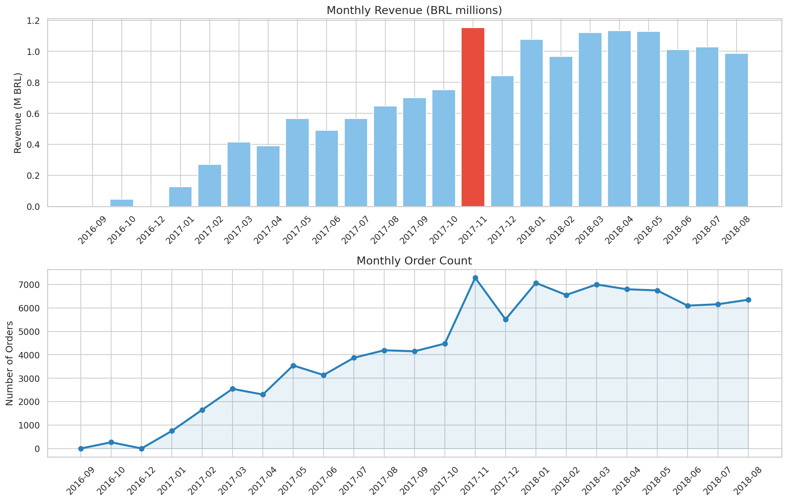
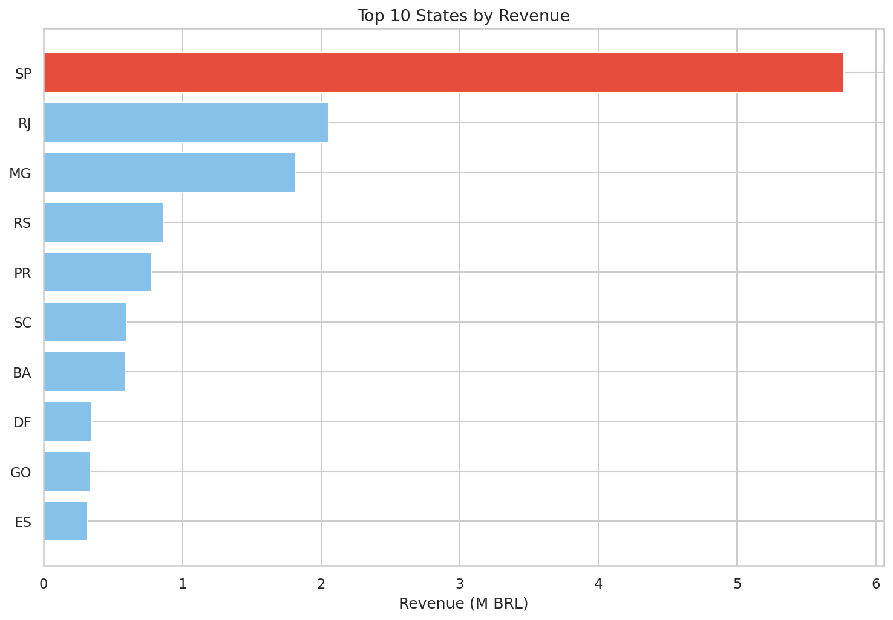
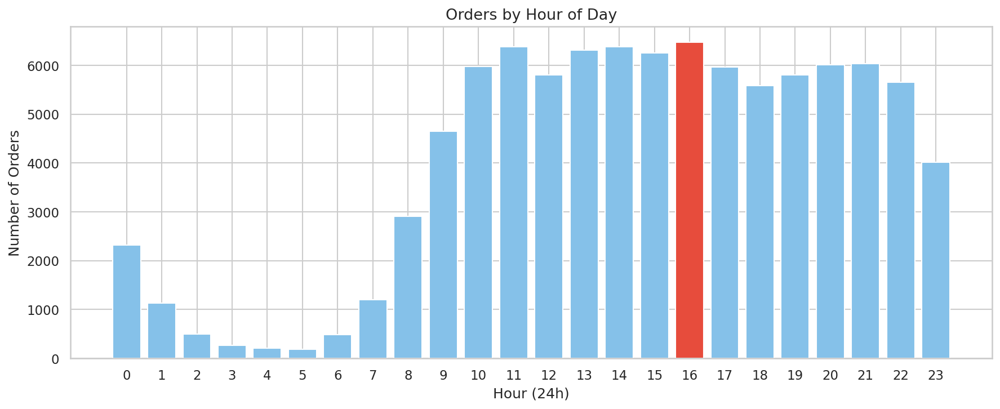
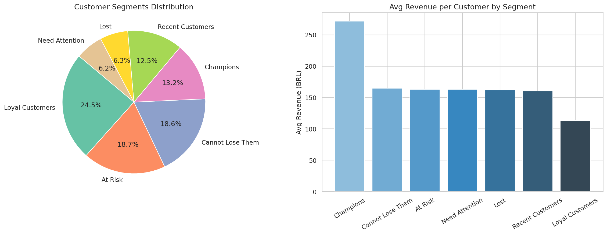
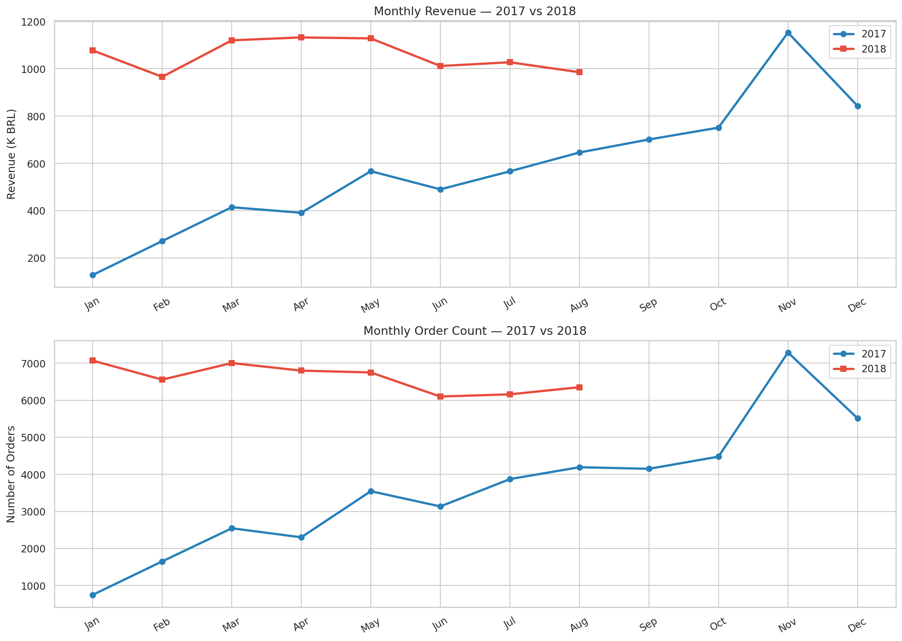
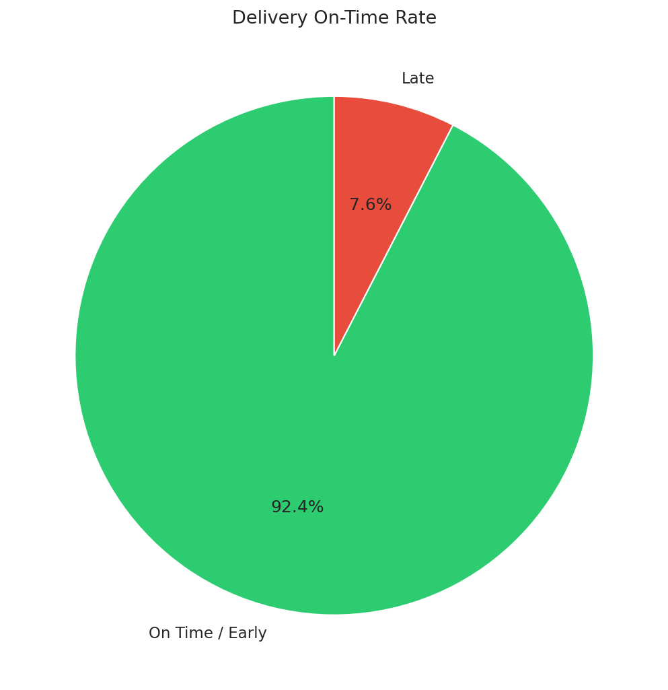

# Olist E-Commerce Sales Analysis

Sales strategy analysis built on Olist's publicly released transaction data — 100K orders, 9 tables, 2 years of Brazilian e-commerce activity.

---

## Business Questions
1. What was the best month for sales?
2. Which state had the highest revenue?
3. What is the best time of day to advertise?
4. What are the best-selling product categories?
5. What products are most often bought together?
6. Who are the most valuable customers? (RFM Segmentation)
7. How do review scores correlate with sales performance?
8. How did the business grow year-over-year?
9. What payment methods do customers prefer?
10. How reliable is the delivery performance?

---

## Key Findings

### 1. Monthly Revenue

November 2017 was the peak month — Black Friday effect. Concentrate inventory and promotions in the Oct–Nov window.

### 2. Revenue by State

São Paulo accounts for ~38% of total revenue. Focus logistics and delivery expansion here first.

### 3. Best Time to Advertise

Peak ordering hour is 16:00 on Mondays. Run paid ads between 15:00–17:00. Avoid weekend campaigns.

### 4. RFM Customer Segmentation

Most customers only buy once — retention is the core business problem. 17,411 high-value customers need re-engagement.

### 5. Year-over-Year Growth

+22.1% revenue growth and +21.5% order growth from 2017 to 2018. Olist scaled through customer acquisition, not price increases.

### 6. Delivery Performance

92.4% on-time rate. Olist under-promises by 11 days on average — directly explains the high 5-star review rate.

---

## Dataset
- **Source:** [Brazilian E-Commerce Public Dataset by Olist](https://www.kaggle.com/datasets/olistbr/brazilian-ecommerce)
- **Period:** September 2016 – October 2018
- **Orders:** 99,441
- **Tables:** 9 relational CSVs

## Tools
Python · Pandas · Matplotlib · Seaborn · Plotly · Mlxtend · Google Colab

## How to Run
1. Open the notebook in Google Colab
2. Add your Kaggle API credentials in Cell 4
3. Run all cells top to bottom
